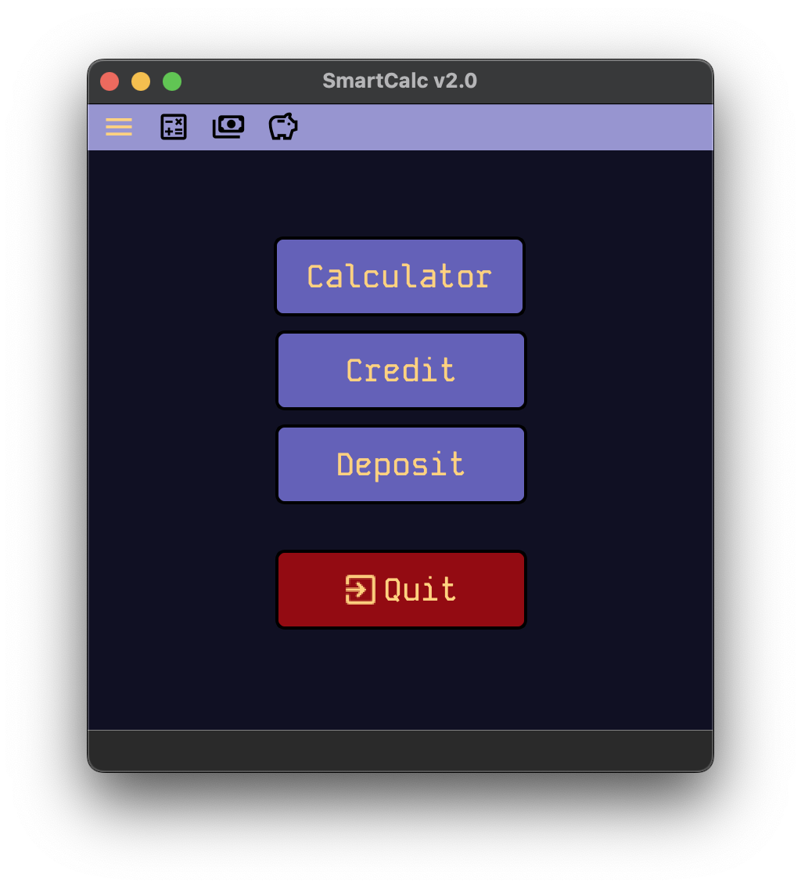
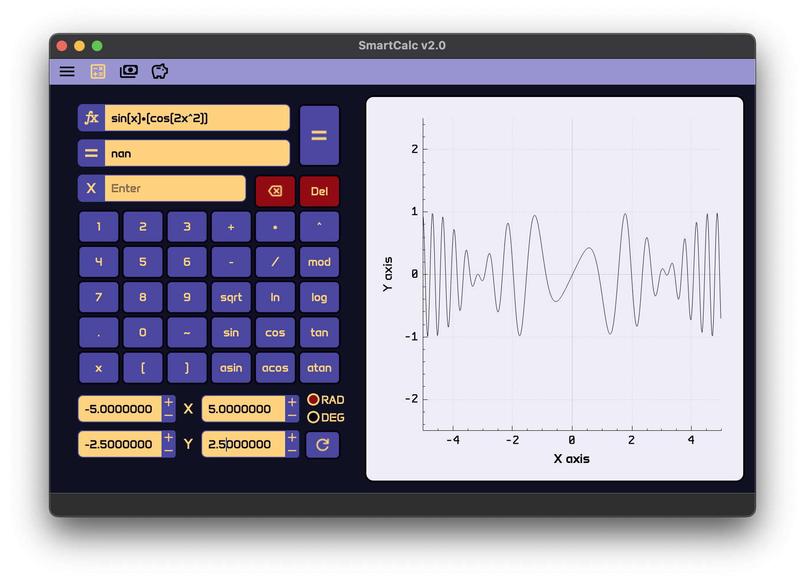
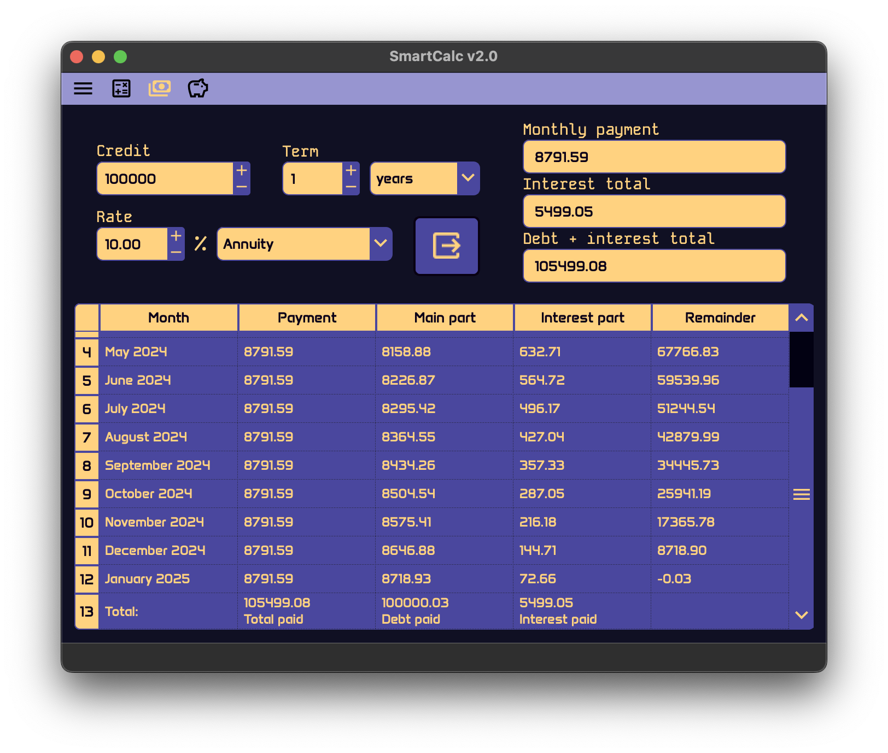
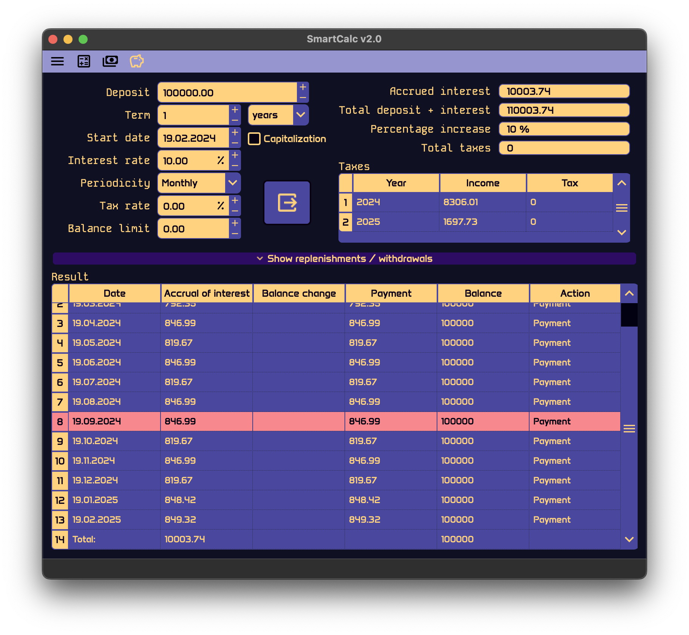
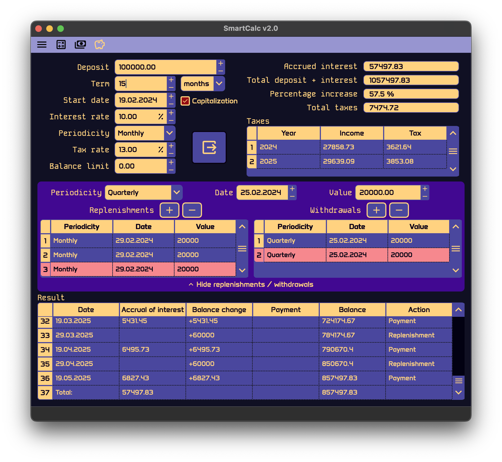

# SmartCalc v2.0

## Introduction

The program is an implementation of calculator, graph plotter, credit/deposit calculator combined, created for educational purpose.
About code: it is written completely with C++ according to MVC pattern. UI was created in QT Creator, using QT Designer with stylesheets. Graph plot uses QCustomplot library, which is open-source library.

Unit tests for main logic are provided and require cmake for running. Tests use `gtest` library to perform. To create coverage report run `make gcov_report`. Make sure to install lcov/gcov. Total code coverage is 98.9%.

## Content

1. [Install](#install)
2. [Uninstall](#uninstall)
3. [Misc](#misc)
4. [Main menu](#main-menu)
5. [Calculator and graph plot](#calculator-and-graph-plot)
6. [Credit calculator](#credit-calculator)
7. [Deposit calculator](#deposit-calculator)
8. [Author](#author)

## Install

In order to be built the program requires C++ compiler(gcc or clang), Qt, qmake or cmake and make. The program is supposed to use Qt 6.0 or greater version, though may work on 5.x.x versions. \
All `make` commands are supposed to be performed in source directory that contains Makefile.

To install application use `make install` command. \
The program will be installed by using either qmake (preferred) or cmake (`qmake_install` or `cmake_install` to force explicitly).
The application exe file will be located in source directory `SmartCalc_v2.0/SmartCalc_v2` of the project. \
Use `make run` to run program. \

## Uninstall

To uninstall application use `make uninstall` command.

## Misc

- `make clean` - clear all files created during installation or else.
- `make dist` - create distribution archive `.tar` with all content.
- `make distclean` - delete created distribution archive.
- `make dvi` - open README.md.
- `make test` - perform tests for modules. It uses `gtest` library.
- `make gcov_report` - perform tests and create code analysis report. It uses `lcov` utility.
- `make style` - check for codestyle.
- `make memtest` - use memcheck utility to analyze for leaks with tests. Uses `valgrind` or `leaks` depending on OS.
- `make memtest_app` - use memcheck utility to analyze for leaks with running app.

## Main menu

Options are regular calculator with graph plot, bank credit or deposit calculator. \
To select program modules you also can use top panel in any time.

## Calculator and graph plot

Provides ordinary calculation functions and operators. Expression can have `x`, and its value can be put into the field below. To get result of calculation, as well as graph, click `=` button. \
The programm supports Radian/Degree switching. Axis is scaled by setting limitations, scale is also can be changed by zooming and swiping on the plot using mouse. \
If result can't be represented it puts `nan` or `infinity`, if error occured - `Error`.

## Credit calculator

The module calculates bank credit payments by both annuity and differential methods. It provides calculated monthly payments and total values at the end of period. \
Behaviour replicates `calcus.ru` implementation of credit calculator.

## Deposit calculator

The module calculates deposit payments by period of time considering start values. It supports capitalization, tax calculation, setting minimum balance remainder, etc.

In order to set up replenishments and withdrawal schedule you can open widget in the middle. To remove row from any of two tables, select it and press according `-` button. \
The program tries to repeat `calcus.ru` implementation of deposit calculator, though it has some inconsistencies.

## Author

`https://github.com/alexvnderftw`