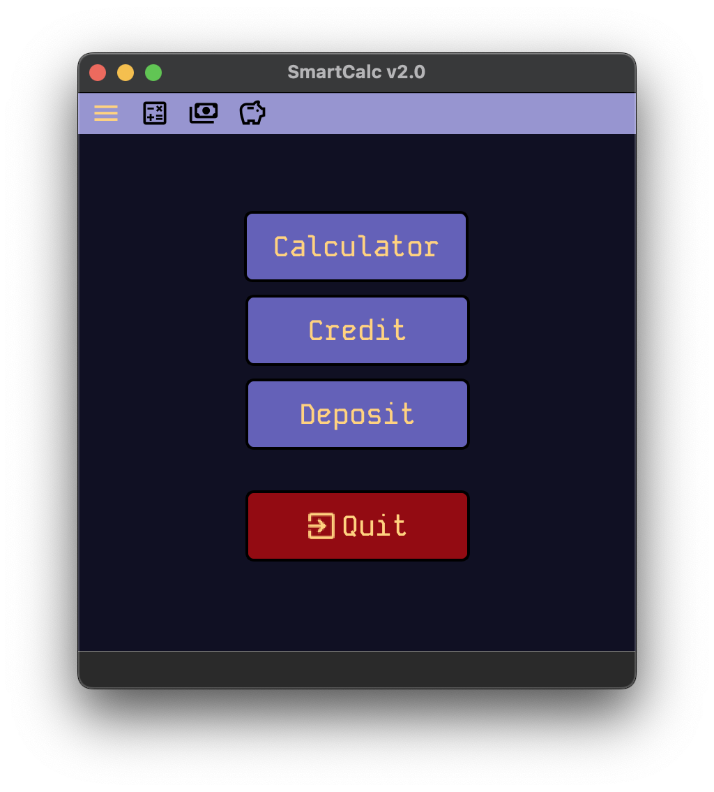
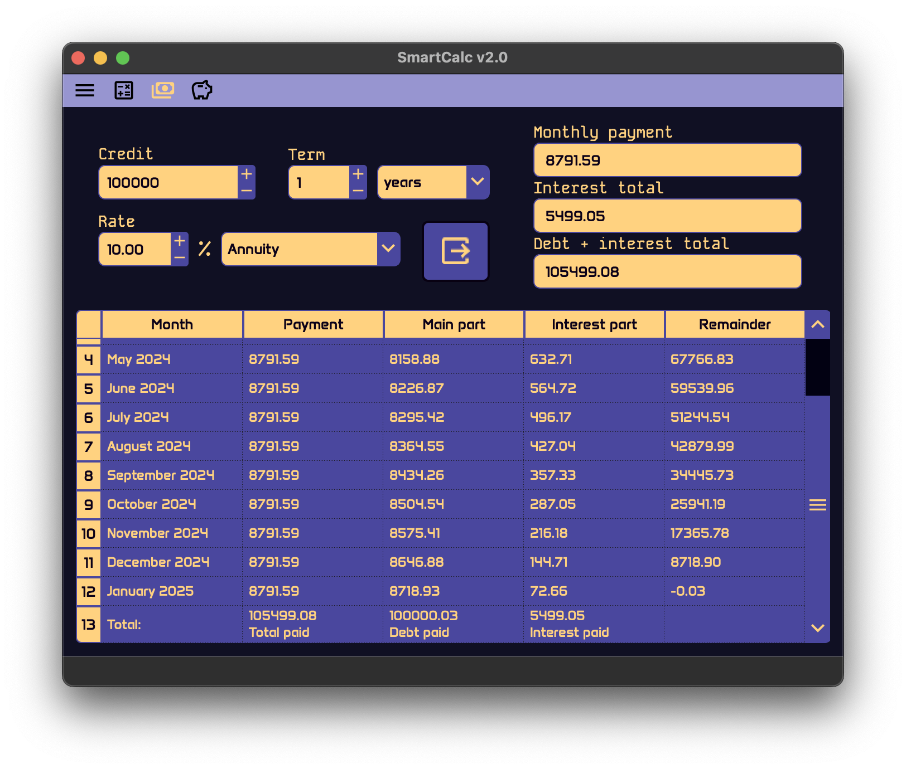

# СмартКалк в2.0

## Введение

- Программа представляет из себя калькулятор с построением графиков, кредитный и депозитный калькулятор в одном десктопном приложении, создан в образовательных целях.
- Написана на полностью на C++ с соблюдением принципа MVC. Интерфейс написан в QT Creator, дизайн в QT Designer с активным использованием stylesheets. Построение графика реализовано с помощью open-source библиотеки QCustomPlot.

- Предусмотрены юнит-тесты с использованием библиотеки `gtest`, примеры для тест-кейсов были взяты с портала calcus.ru. Отчет от `lcov/gcov` показывает 98.9% покрытия кода.

## Содержание

1. [Установка](#установка)
2. [Удаление](#удаление)
3. [Разное](#разное)
4. [Главное меню](#главное-меню)
5. [Калькулятор и график](#калькулятор-и-график)
6. [Кредитный калькулятор](#кредитный-калькулятор)
7. [Депозитный калькулятор](#депозитный-калькулятор)
8. [Автор](#автор)

## Установка

- Для установки необходим make, C++ компилятор (gcc, clang), Qt, qmake или cmake. Для стабильной работы рекомендуется версия Qt 6 или выше, но на 5.x.x версии тоже запускается.
- Все команды `make` запускать из корневой директории, где расположен Makefile.

- Для установки программы - `make install`. Программа установится через qmake (предпочтительнее) или cmake (`qmake_install` or `cmake_install` для установки напрямую).
- Запускаемый файл приложения будет расположен в директории проекта `SmartCalc_v2.0/SmartCalc_v2`.
- Для запуска можно использовать `make run`.

## Удаление

- Для удаления приложения введите `make uninstall`.

## Разное

- `make clean` - очищает все файлы созданные во время компиляции.
- `make dist` - создает архив `.tar`, содержащий все необходимые файлы для установки.
- `make distclean` - удаляет созданный архив.
- `make dvi` - открывает инструкцию.
- `make test` - выполняет интеграционные тесты для модулей.
- `make gcov_report` - запускает тесты и формирует отчет о покрытии кода. Использует утилиту `lcov`.
- `make style` - проверяет стиль кода на соответствие Google.
- `make memtest` - проверяет программу на утечки памяти запуская тесты. Использует `valgrind` или `leaks` утилиты в зависимости от ОС.
- `make memtest_app` - проверяет программу на утечки памяти запуская приложение.

## Главное меню

- В приложении доступны обычный калькулятор с построением графика, вычисление данных банковского кредита или депозита.
- Выбрать модуль можно также из верхнего меню иконок.

## Калькулятор и график

- Предоставляет функции калькулятора с построением графика в отдельном окне. Поле для выражения позволяет ввести `x` переменную, а его значение можно ввести в отдельном поле ниже. Для вычисления и построения графика нажмите кнопку `=`.
- Программа также поддерживает смену радиан на градусы и наоборот. Масштаб для осей графика можно настроить введя граничные значение или зумом и сдвигом в окне графика при помощи мыши.
- Если результат не может быть представлен числом, на вывод будет подан либо `nan`, либо `infinity`, в случае ошибки - `Error`.

## Кредитный калькулятор

- Модуль рассчитывать график платежей по кредиту и итоговые значения используя аннуитетный или дифференцированный тип платежа. Платежи производятся помесячно до конца периода.
- Поведение калькулятора основывается на реализации `calcus.ru` кредитного калькулятора.

## Депозитный калькулятор

- Модуль рассчитывает платежи по депозиту учитывая период, периодичность выплат, капитализацию и прочее.

- Для ввода пополнений и снятий можно открыть виджет в центре. Чтобы убрать введенную строку, нужно выделить ее в таблице и нажать кнопку удаления `-` над нужной таблицей. Чтобы свернуть виджет нажмите на кнопку внизу виджета.
- Программа реализует схожее поведение с реализацией `calcus.ru` депозитного калькулятора, хоть он и выдает иногда спорные результаты.
- Для расчетов использовался тип данных `long double`, так что есть возможность поднять точность используя какую-нибудь реализацию типа данных `decimal64`, которого нет в стандартной библиотеке C++.

## Автор

`https://github.com/alexvnderftw`